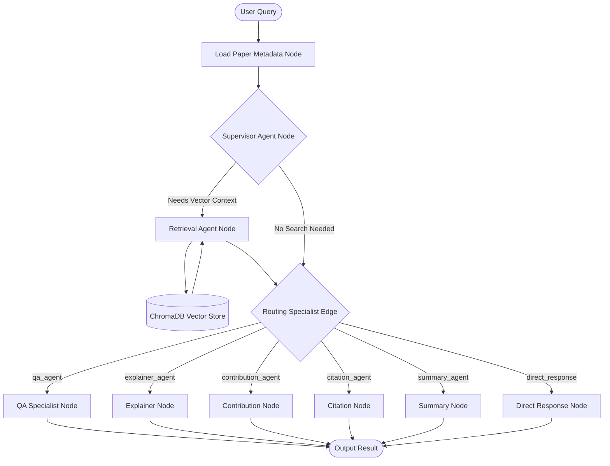
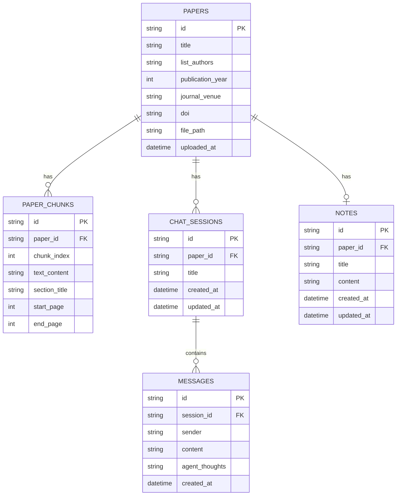

# ResearchMind AI 🧠

### Intelligent Multi-Agent Research Paper Assistant

ResearchMind AI is a production-grade Agentic AI application designed for querying, summarizing, and capturing structured study notes from academic journals and research literature. 

Rather than relying on generic, flat RAG context retrievals, ResearchMind AI implements a **multi-agent state coordination architecture** (built on LangGraph and FastAPI) to route questions to specialized domain experts, analyze mathematical formulas, parse citation reference nodes, and build auto-saving Markdown workbenches.

---

## 🚀 Key Features

- **Block-Aware Layout PDF Parsing**: Segment documents page-by-page, dynamically recognizing section boundaries (`Abstract`, `Introduction`, `Methodology`, `Results`, `References`) to prevent cross-contextual noise.
- **Offline Dense Vector Seeding**: Uses a local Sentence Transformers engine (`all-MiniLM-L6-v2`) generating 384-dimensional embeddings offline, reducing token bills.
- **Multi-Agent Coordination (LangGraph)**:
  - **Supervisor Node**: Parses user intent and determines routing paths.
  - **QA Specialist**: Fact-checks stats and maps citation sources against page ranges.
  - **Technical Explainer**: Breaks down mathematical symbols, LaTeX equations, and algorithms.
  - **Contribution Analyst**: Evaluates author claims, experimental novelties, and system constraints.
  - **Citation Resolver**: Identifies bibliography keys, publication years, and DOI links.
- **Sleek Side-by-Side Dashboard**:
  - Drag-and-drop PDF ingestion files modals.
  - Real-time message streaming with collapsible **Agent Reasoning Thought Logs**.
  - Auto-saving Markdown study Notes Editor (saves after 1.5s of inactivity).
  - Client-side downloader exporting study notes as Markdown (`.md`), plain text (`.txt`), or structured JSON.
- **Simulated JWT Authentication**: Access verification safeguards with localStorage session states.

---

## 📐 Orchestration Architecture

Below is the execution flow of the ResearchMind AI LangGraph multi-agent routing loop:



---

## 📁 Project Structure

```bash
researchmind-ai/
├── backend/                  # FastAPI Application
│   ├── app/
│   │   ├── api/              # REST route controllers (papers, chats, notes, auth)
│   │   ├── core/             # Base configurations (settings, exceptions)
│   │   ├── database/         # SQLAlchemy db configurations
│   │   ├── domain/           # Repository abstract base interfaces
│   │   ├── graphs/           # LangGraph workflow compilation (state, workflow)
│   │   ├── middleware/       # JWT token security decoders
│   │   ├── models/           # Relational SQLite ORM schemas
│   │   ├── parsers/          # layout segmenters (pdf_parser, chunker)
│   │   ├── prompts/          # System agent prompt templates
│   │   ├── repositories/     # Concrete SQLAlchemy CRUD queries
│   │   ├── schemas/          # Pydantic input/output validation models
│   │   └── services/         # Orchestration layers (pdf_service, memory_service, embedding_service)
│   ├── tests/                # Test suites (E2E, integration, API, unit tests)
│   ├── Dockerfile
│   └── requirements.txt
├── frontend/                 # Vite React TypeScript Client
│   ├── src/
│   │   ├── components/       # Custom design variants (Button, Card, Input)
│   │   ├── features/         # Modular panels (upload, chat, notes, auth)
│   │   ├── hooks/            # TanStack Query custom hooks (usePapers, useChats)
│   │   ├── layouts/          # Main dashboard sidebar wireframes
│   │   ├── pages/            # View managers (DashboardPage)
│   │   ├── services/         # Axios API clients
│   │   ├── store/            # Zustand theme and thread stores
│   │   ├── types/            # TypeScript interfaces matching FastAPI schemas
│   │   └── utils/            # CN utilities and exporter wrappers
│   ├── Dockerfile
│   └── nginx.conf
├── DEPLOYMENT.md             # Complete Operations Manual
├── docker-compose.yml        # Multi-container orchestration configuration
└── README.md                 # Project Overview
```

---

## 🗄️ Relational Database Schema

SQLite handles all relational operations, mapping thread indices and study notes:



---

## 🚀 Quick Start Guide

### 1. Configure Secrets
Create a `.env` file in the root project folder:
```bash
OPENAI_API_KEY=sk-proj-yourApiKeyHere
```

### 2. Deploy Container Stack
Launch backend APIs and web panels containerized:
```bash
docker compose up --build -d
```
The Frontend client boots on [http://localhost](http://localhost) and the FastAPI Swagger UI maps to [http://localhost:8000/docs](http://localhost:8000/docs). Login using credentials: `admin` / `password123`.

### 3. Run Pipeline Tests
To verify all relational databases, PDF segmentations, local vector models, and multi-agent workflows function correctly, execute the end-to-end test suite:
```bash
cd backend
.venv\Scripts\python.exe tests/test_e2e.py
```

For full setup procedures, migrations details, and named volume backup commands, review the [Deployment Operations Manual (DEPLOYMENT.md)](file:///C:/Users/Hp/.gemini/antigravity/scratch/researchmind-ai/DEPLOYMENT.md).
